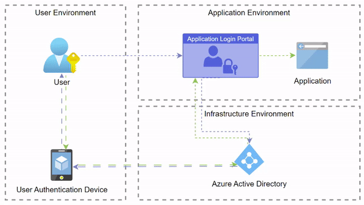

# Snowflake Build

[![Build Status][travis-image]][travis-url]

This repo contains all the elements involved in setting up and configuring the Snowflake application 
This pipeline will setup and install Snowflake utilities in a target environment  


`By following the steps in this repo you will create a new secure Snowflake Environment`

<br>

## Solution Diagrams
<br>
SSO & MFA implementation


## What is snowflake


Snowflake is a cloud-based data warehousing platform that is designed to make it easy to store, analyze, and query large amounts of structured and semi-structured data. Some of the main features of Snowflake include:

- Scalability: Snowflake allows users to scale their data storage and processing resources up or down as needed, without the need for complex infrastructure management.

- Data warehousing: Snowflake provides a powerful SQL-based data warehousing platform that supports both structured and semi-structured data, making it easy to store and analyze large amounts of data.

- Data sharing: Snowflake's unique architecture allows for easy data sharing across teams, organizations, and even external partners, enabling collaboration and data-driven decision-making.

- Time travel: Snowflake's time travel feature allows users to query data as it existed at a specific point in the past, by specifying a version of the table or the entire database as of a particular timestamp.

- Security: Snowflake provides a robust security model that includes encryption, data masking, and role-based access control, ensuring that data is protected at all times.

- Cloud-agnostic: Snowflake supports multiple cloud providers including AWS, Azure, and Google Cloud, enabling customers to choose the cloud that is best suited for their needs.

- Concurrent data loading and querying: Snowflake allows loading and querying data at the same time, which eliminates the need for data loading during non-business hours.

- Support for multiple data sources: Snowflake supports loading data from various data sources including flat files, NoSQL databases, and streaming data, making it easy to integrate data from multiple sources into a single platform.

- Performance: Snowflake supports high-performance analytics with columnar storage, advanced compression, and a unique micro-partitioning architecture that enables high concurrency and low-latency query execution.

In summary, Snowflake is a powerful and versatile data warehousing platform that is designed to make it easy to store, analyze, and query large amounts of data. With its scalability, data warehousing, data sharing, time travel, security, and support for multiple data sources and cloud providers, Snowflake is well suited for organizations of all sizes and industries.


## Build Tasks

#### Intial Setup
*build sql artifacts are executed in order as listed below*
- [Build_Env.sql](src\initial_setup_queries\Build_Env.sql) Create base env objects in Snowflake(Databases, Warehouses)
- [Build_Schemas.sql](src\initial_setup_queries\Build_Schemas.sql) Creates base subject areas for storing data in each DB (Application_Data, Retail_Data, Master_Data, People_Data,Finance_Data,Supply_Chain,Sandbox_Data)
- [Build_Stages.sql](src\initial_setup_queries\Build_Stages.sql) Creates stages that will allow Snowflake to read data from Azure Blob. Stages use self renewing sas tokens that don't expire
- [Build_Functional_Admin_Roles.sql](src\initial_setup_queries\Build_Functional_Admin_Roles.sql) Builds all functional roles used by applications to pull or push data
- [Build_Permissions_Object.sql](src\initial_setup_queries\Build_Permissions_Object.sql) Creates Admin Database and objects to manage permissions in Snowflake. Follows Linux permission naming convention (RWX)


## Environment Information
Snowflake Org:
```
Environment         :   Production
Organization        :	
Name                :	
Cloud               :	
Region              :	
Edition             :	
Locator             :	
Verison             :   1.0
```
[Link]()


## Application Dependencies:

### ETL / ELT 

[ETL Tool]()

```
Environment             : Production
Application             : ETL Tool Name
Name                    : 
OS                      : 
Verison                 : 1.0
```

```
Environment             : Test
Application             : ETL Tool Name
Name                    : 
OS                      : 
Verison                 : 1.0
```

```
Environment             : Development
Application             : ETL Tool Name
Name                    : 
OS                      : 
Verison                 : 1.0
```
## ML & Datascience
[Databricks]()
```
Environment             : Production
Application             : Databricks
Name                    : 
Verison                 : 1.0
```

```
Environment             : Test
Application             : Databricks
Name                    : 
Verison                 : 1.0
```

```
Environment             : Development
Application             : Databricks
Name                    : 
Verison                 : 1.0
```

[Storage Account]()
```
Environment             : Production
Application             : Storage Account ADLS Gen2
Name                    : 
Verison                 : 1.0
```
```
Environment             : Test
Application             : Storage Account ADLS Gen2
Name                    : 
Verison                 : 1.0
```
```
Environment             : Development
Application             : Storage Account ADLS Gen2
Name                    : 
Verison                 : 1.0
```


[Keyvault]()
```
Environment             : Production
Application             : Key Vault
Name                    : 
Verison                 : 1.0
```
```
Environment             : Test
Application             : Key Vault
Name                    : 
Verison                 : 1.0
```
```
Environment             : Development
Application             : Key Vault
Name                    : 
Verison                 : 1.0
```


## Execution logic

When commiting a new file to main with tag #build# on the Repo a user will trigger a build action on the pipeline which will build a new environment from scratch. 
## Release History

* 0.0.1
    * Initial Commit

## Meta
Repo Owner – sebastian.hansen@dataalchemy.dev

## Contributing

1. Fork it 
2. Create your feature branch (`git checkout -b feature/fooBar`)
3. Commit your changes (`git commit -am 'Add some fooBar'`)
4. Push to the branch (`git push origin feature/fooBar`)
5. Create a new Pull Request

![Deployment Solution][deployment-diagram]

 [More Details on Forking a repo](forking-repo)
<!-- Markdown link & img dfn's -->


[travis-image]: https://img.shields.io/travis/dbader/node-datadog-metrics/master.svg?style=flat-square
[travis-url]: https://travis-ci.org/dbader/node-datadog-metrics
[deployment-diagram]: https://lucid.app/publicSegments/view/714776b6-8cb5-4280-9957-ee1300c696d1/image.png
[forking-repo]: https://docs.microsoft.com/en-us/azure/devops/repos/git/forks?view=azure-devops&tabs=visual-studio-2019
[choco]: https://community.chocolatey.org/courses/getting-started/what-is-chocolatey
[snowflake-pbi-integration]: https://docs.snowflake.com/en/user-guide/oauth-powerbi.html

