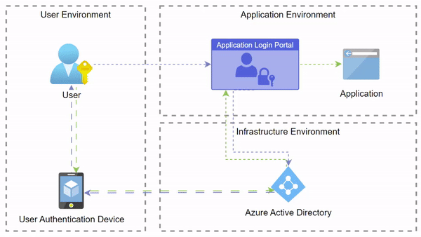

# Security 

Snowflake is a security first SaaS platform it provides a suite of tools that you can use to secure your environment

## RBAC (role-based access control)

In RBAC, users are assigned roles ​that determine what actions they ​can perform and what data they ​can access. Think of a role as the different departments at a company we might have a finance team, a HR team and a operations team. All of the people that belong to those teams have different jobs and need to complete different tasks. This is the same with roles. We want to make sure that everyone that is able to do their job but still keeping security in mind.

Here is a logical organization of how we can group our roles:
<br>


# Setting up SSO and SCIM for Snowflake with Azure AD
This guide will walk you through the steps to configure SSO and SCIM for Snowflake with Azure AD.

#
### Solution Diagram
<br>


#
## Prerequisites
- Access to the Azure Portal
- Snowflake account with account admin role

## Manual Steps
1. Login to the azure portal

2. In the search bar type enterprise registrations

3. Create a new enterprise app registration

4. Search for Snowflake for AAD click on it and hit create

5. On the side bar click under manage click Single sign-on

6. In the Basic SAML Configuration section, perform the following steps, if you wish to configure the application in IDP initiated mode:

    a. In the Identifier text box, type a URL using the following pattern: https://{SNOWFLAKE-URL}.snowflakecomputing.com

    b. In the Reply URL text box, type a URL using the following pattern: https://{SNOWFLAKE-URL}.snowflakecomputing.com/fed/login

7. On the Set up Single Sign-On with SAML page, in the SAML Signing Certificate section, click Download to download the Certificate (Base64) from the given options as per your requirement and save it on your computer.

8. Login to Snowflake with an account admin role and execute the following query make sure to do the following populate the parameterized sections in this script seen with {}, to your actual values (remove {})
```
    CREATE SECURITY INTEGRATION AZURE_AAD_INTEGRATION
    TYPE = SAML2
    ENABLED = TRUE
    SAML2_ISSUER = 'https://sts.windows.net/{enter your tenant}/'
    -- (This is entity ID in the Identifier Provider Metadata downloaded earlier and will be in a URL format and it is the value "Azure AD Identifier" on the Azure AD. Make sure you preserve the trailing slash symbol)
    SAML2_SSO_URL = 'https://login.microsoftonline.com/{enter your tenant}/saml2'
    --(this is the Login URL. you copied earlier)
    SAML2_PROVIDER = 'CUSTOM'
    SAML2_X509_CERT = '{enter your cert here}'
    -- (DO NOT ENTER THE BEGIN OR END CERTIFICATE TAGS)
    SAML2_SP_INITIATED_LOGIN_PAGE_LABEL = 'AzureADSSO'
    SAML2_ENABLE_SP_INITIATED = TRUE;

    show parameters like 'SAML_IDENTITY_PROVIDER' in account;
    desc security integration AZURE_AAD_INTEGRATION;

    alter security integration AZURE_AAD_INTEGRATION 
      set saml2_snowflake_acs_url = 'https://{your account identifier}.snowflakecomputing.com/fed/login';
    alter security integration AZURE_AAD_INTEGRATION 
      set saml2_snowflake_issuer_url = 'https://{your account identifier}.snowflakecomputing.com';
```
9. Go back to the enterprise app in azure and test your connection from the single sign-on page 

10. To configure SCIM we will run the following query in Snowflake. This will generate a token which we need to copy for our next step

```
    use role accountadmin;
    create role if not exists aad_provisioner;
    grant create user on account to role aad_provisioner;
    grant create role on account to role aad_provisioner;
    grant role aad_provisioner to role accountadmin;
    create or replace security integration aad_provisioner
        type = scim
        scim_client = 'azure'
        run_as_role = 'AAD_PROVISIONER';
    select system$generate_scim_access_token('aad_provisioner');
```

11. Return to azure and go to the provisioning tab and complete the following steps:

    - Switch Provisioning Mode to Automatic
    - Input your tenant URL
    - Paste your token from the previous step into

For more information you can review these links:

- [setting up sso][sso]
- [setting up scim][scim]


<!-- Markdown link & img dfn's -->

[sso]:https://learn.microsoft.com/en-us/azure/active-directory/saas-apps/snowflake-tutorial
[scim]:https://docs.snowflake.com/en/user-guide/scim-azure
[rbac]:https://lucid.app/publicSegments/view/91efca2a-b63b-4554-8d7d-f08e29eefecf/image.png
 
